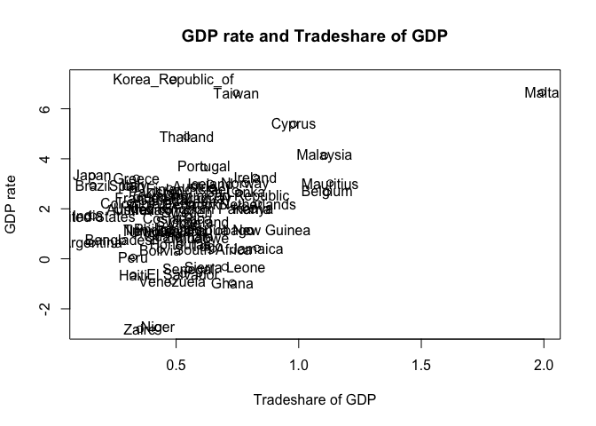
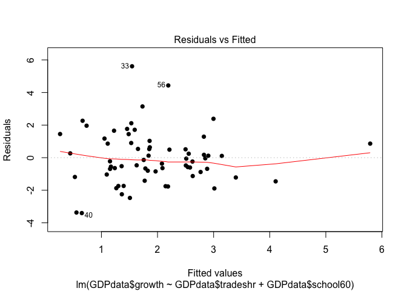
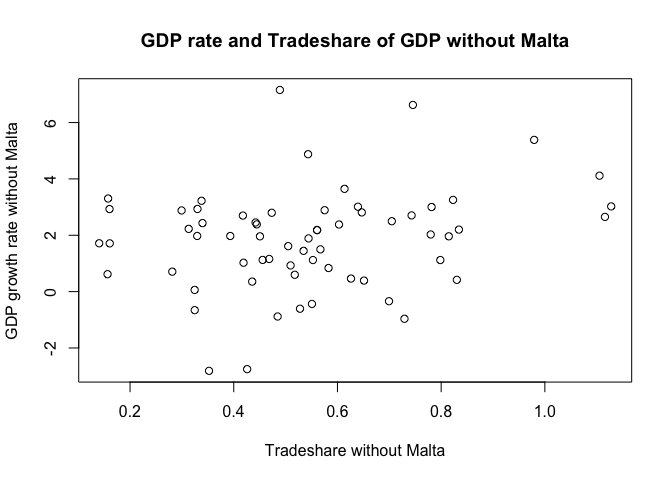
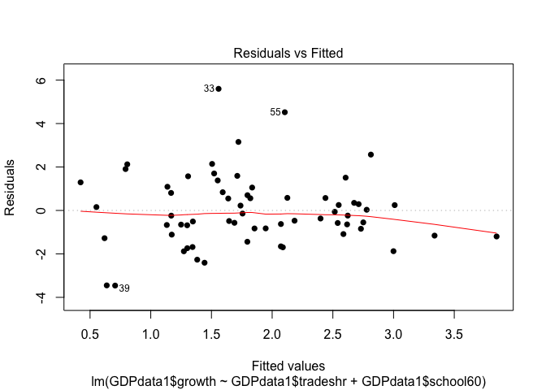
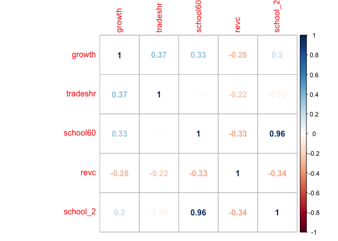

Post
================
Site Bai
10/29/2017

Multiple Regression Analysis.
-----------------------------


=================================================

##### R has been highly used to create as many as cool graphs or useful functions even to build up a website with shiny.app that viewed and manipulated by people who never used R before. However, I believe that R is mostly known for analyzing data and providing powerful analysis with visualization for broad disciplines. Therefore, this post is focusing on showing how to apply function learned from lecture and outside the class to analyse multyple regression by applying several incredible packages.

##### The data I am using is about the annual growth rate of GDP and other related variables among 65 countries.You could download file [here](https://docs.google.com/a/berkeley.edu/spreadsheets/d/1D1sCu_JMKKtHhMOQeI7R6sYD-33XYMQsrAsXcSR8XtY/edit?usp=sharing).

##### First we could install and call several necessary packages.

-   ##### "gdata" for downloding xls file.

-   ##### "stargazer" for creating fancy and usefull summary table.

-   ##### "corrplot" for creating correlation plot.

-   ##### "dplyr" for adjusting data frame.

``` r
GDPdata <- read.xls("data/growthdata.xls")
head(GDPdata)
```

    ##      country    growth  tradeshr  corrupt  assassin oil school60      revc
    ## 1  Argentina 0.6176451 0.1566230 6.011905 1.9333330   0     4.99 0.9333333
    ## 2  Australia 1.9751470 0.3294792 8.511905 0.0666667   0     9.03 0.0000000
    ## 3    Austria 2.8891850 0.5752748 8.571428 0.0000000   0     3.65 0.0000000
    ## 4 Bangladesh 0.7082631 0.2814584 1.011905 0.1750000   0     0.79 0.3064815
    ## 5    Belgium 2.6513350 1.1159170 8.809524 0.0000000   0     7.46 0.0000000
    ## 6    Bolivia 0.3550578 0.4355793 2.797619 0.2000000   0     4.68 0.9703704
    ##      civil capstock60
    ## 1 3.966666      5.623
    ## 2 1.000000     19.100
    ## 3 1.000000      7.915
    ## 4 3.966666      0.536
    ## 5 1.000000     11.725
    ## 6 4.833333      2.196

``` r
plot(GDPdata$tradeshr,GDPdata$growth,xlab = "Tradeshare of GDP",
    ylab = "GDP rate",
    main = "GDP rate and Tradeshare of GDP"
     )
with(GDPdata[1:65,],text(GDPdata$tradeshr,GDPdata$growth,labels=GDPdata$country[1:65]))
```



##### In the plot above, you may notice that there is a country located far away from other countries. Do you consider it is a [outlier](http://www.theanalysisfactor.com/outliers-to-drop-or-not-to-drop/)?

``` r
reg1 <- lm(GDPdata$growth~GDPdata$tradeshr+GDPdata$school60)
summary(reg1)
```

    ## 
    ## Call:
    ## lm(formula = GDPdata$growth ~ GDPdata$tradeshr + GDPdata$school60)
    ## 
    ## Residuals:
    ##     Min      1Q  Median      3Q     Max 
    ## -3.4020 -0.8798 -0.2237  0.8622  5.6108 
    ## 
    ## Coefficients:
    ##                  Estimate Std. Error t value Pr(>|t|)   
    ## (Intercept)       -0.4333     0.5621  -0.771  0.44367   
    ## GDPdata$tradeshr   2.4302     0.7178   3.386  0.00124 **
    ## GDPdata$school60   0.2449     0.0815   3.005  0.00383 **
    ## ---
    ## Signif. codes:  0 '***' 0.001 '**' 0.01 '*' 0.05 '.' 0.1 ' ' 1
    ## 
    ## Residual standard error: 1.657 on 62 degrees of freedom
    ## Multiple R-squared:  0.2465, Adjusted R-squared:  0.2222 
    ## F-statistic: 10.14 on 2 and 62 DF,  p-value: 0.0001547

``` r
plot(reg1,pch=16,which = 1)
```



##### The plot above tells that the residuals of this regression is homoscedasticity or heteroscedasticity? In case you have no idea what they are. You could find the full information [here](http://www.statisticshowto.com/homoscedasticity/).

##### How about we delete that country from the data?

``` r
GDPdata1 <- GDPdata[-35,]
new_reg1 <- lm(GDPdata1$growth~GDPdata1$tradeshr+GDPdata1$school60)
plot(GDPdata1$tradeshr,GDPdata1$growth,xlab = "Tradeshare without Malta",ylab = "GDP growth rate without Malta", main = "GDP rate and Tradeshare of GDP without Malta")
```



``` r
summary(new_reg1)
```

    ## 
    ## Call:
    ## lm(formula = GDPdata1$growth ~ GDPdata1$tradeshr + GDPdata1$school60)
    ## 
    ## Residuals:
    ##     Min      1Q  Median      3Q     Max 
    ## -3.4580 -0.9041 -0.2382  0.8145  5.5982 
    ## 
    ## Coefficients:
    ##                   Estimate Std. Error t value Pr(>|t|)   
    ## (Intercept)       -0.21090    0.65462  -0.322  0.74842   
    ## GDPdata1$tradeshr  2.04236    0.92399   2.210  0.03084 * 
    ## GDPdata1$school60  0.23868    0.08239   2.897  0.00523 **
    ## ---
    ## Signif. codes:  0 '***' 0.001 '**' 0.01 '*' 0.05 '.' 0.1 ' ' 1
    ## 
    ## Residual standard error: 1.665 on 61 degrees of freedom
    ## Multiple R-squared:  0.1683, Adjusted R-squared:  0.141 
    ## F-statistic: 6.171 on 2 and 61 DF,  p-value: 0.003624

``` r
plot(new_reg1,which=1,pch=16)
```



##### Do you wanna compare two regressions in one table at one time instead of draging your screen up and down? Here "stargazer" is!

``` r
stargazer(reg1,new_reg1,type = "text")
```

    ## 
    ## ================================================================
    ##                                 Dependent variable:             
    ##                     --------------------------------------------
    ##                             growth                growth        
    ##                              (1)                    (2)         
    ## ----------------------------------------------------------------
    ## tradeshr                   2.430***                             
    ##                            (0.718)                              
    ##                                                                 
    ## school60                   0.245***                             
    ##                            (0.082)                              
    ##                                                                 
    ## tradeshr                                          2.042**       
    ##                                                   (0.924)       
    ##                                                                 
    ## school60                                         0.239***       
    ##                                                   (0.082)       
    ##                                                                 
    ## Constant                    -0.433                -0.211        
    ##                            (0.562)                (0.655)       
    ##                                                                 
    ## ----------------------------------------------------------------
    ## Observations                  65                    64          
    ## R2                          0.246                  0.168        
    ## Adjusted R2                 0.222                  0.141        
    ## Residual Std. Error    1.657 (df = 62)        1.665 (df = 61)   
    ## F Statistic         10.141*** (df = 2; 62) 6.171*** (df = 2; 61)
    ## ================================================================
    ## Note:                                *p<0.1; **p<0.05; ***p<0.01

##### As you can see clearly from the summary table, the coefficient of tradeshare changed amount, which looks like deleting Malta is a good idea. I could even show you by plot. However, if you take one more look, you may change your mind. Why? Because Standard error increased despite of absence of Malta. Therefore, Malta has a chance to be saved. (Poor Malta)

##### How about the effect of schooling years on GDP? Longer the schooling years, higher the GDP? Really?

``` r
school_2 <- (GDPdata$school60)^2
GDPdata <- mutate(GDPdata,school_2)
reg2 <- lm(GDPdata$growth~GDPdata$tradeshr+GDPdata$school60+GDPdata$school_2)
reg3 <- lm(GDPdata$growth~GDPdata$tradeshr+GDPdata$school60+GDPdata$school_2+GDPdata$revc+GDPdata$civil)
stargazer(reg1,reg2,reg3,type="text")
```

    ## 
    ## =======================================================================================
    ##                                             Dependent variable:                        
    ##                     -------------------------------------------------------------------
    ##                                                   growth                               
    ##                              (1)                    (2)                    (3)         
    ## ---------------------------------------------------------------------------------------
    ## tradeshr                   2.430***               2.065***              1.894***       
    ##                            (0.718)                (0.664)                (0.616)       
    ##                                                                                        
    ## school60                   0.245***               1.178***              1.038***       
    ##                            (0.082)                (0.268)                (0.267)       
    ##                                                                                        
    ## school_2                                         -0.101***              -0.093***      
    ##                                                   (0.028)                (0.026)       
    ##                                                                                        
    ## revc                                                                     -1.313        
    ##                                                                          (0.883)       
    ##                                                                                        
    ## civil                                                                    -0.072        
    ##                                                                          (0.139)       
    ##                                                                                        
    ## Constant                    -0.433               -1.706***               -0.875        
    ##                            (0.562)                (0.623)                (0.954)       
    ##                                                                                        
    ## ---------------------------------------------------------------------------------------
    ## Observations                  65                     65                    64          
    ## R2                          0.246                  0.380                  0.459        
    ## Adjusted R2                 0.222                  0.349                  0.412        
    ## Residual Std. Error    1.657 (df = 62)        1.516 (df = 61)        1.360 (df = 58)   
    ## F Statistic         10.141*** (df = 2; 62) 12.457*** (df = 3; 61) 9.841*** (df = 5; 58)
    ## =======================================================================================
    ## Note:                                                       *p<0.1; **p<0.05; ***p<0.01

##### An amazing result is that the squared schooling years decreased GDP annual rate. Why? Also the [p-value](http://statisticsbyjim.com/regression/interpret-coefficients-p-values-regression/) indicats that the squared schooling years is statistically significant.

##### Also,you totally have control to replace standard error that the numbers inside the parenthese with confidence interval, which is adding the argument "ci=TRUE" into the stargazer.

##### For example, the 0.718 under the coefficient of the tradeshare is the standard error of the coefficient.And you could replace with "ci=TRUE" argument.

``` r
stargazer(reg1,reg2,reg3,type="text",ci=TRUE)
```

    ## 
    ## =======================================================================================
    ##                                             Dependent variable:                        
    ##                     -------------------------------------------------------------------
    ##                                                   growth                               
    ##                              (1)                    (2)                    (3)         
    ## ---------------------------------------------------------------------------------------
    ## tradeshr                   2.430***               2.065***              1.894***       
    ##                         (1.023, 3.837)         (0.763, 3.366)        (0.687, 3.102)    
    ##                                                                                        
    ## school60                   0.245***               1.178***              1.038***       
    ##                         (0.085, 0.405)         (0.652, 1.703)        (0.515, 1.561)    
    ##                                                                                        
    ## school_2                                         -0.101***              -0.093***      
    ##                                               (-0.155, -0.046)      (-0.143, -0.042)   
    ##                                                                                        
    ## revc                                                                     -1.313        
    ##                                                                      (-3.044, 0.418)   
    ##                                                                                        
    ## civil                                                                    -0.072        
    ##                                                                      (-0.344, 0.200)   
    ##                                                                                        
    ## Constant                    -0.433               -1.706***               -0.875        
    ##                        (-1.535, 0.668)        (-2.926, -0.485)       (-2.744, 0.995)   
    ##                                                                                        
    ## ---------------------------------------------------------------------------------------
    ## Observations                  65                     65                    64          
    ## R2                          0.246                  0.380                  0.459        
    ## Adjusted R2                 0.222                  0.349                  0.412        
    ## Residual Std. Error    1.657 (df = 62)        1.516 (df = 61)        1.360 (df = 58)   
    ## F Statistic         10.141*** (df = 2; 62) 12.457*** (df = 3; 61) 9.841*** (df = 5; 58)
    ## =======================================================================================
    ## Note:                                                       *p<0.1; **p<0.05; ***p<0.01

##### Furthermore, I could add a title and change the variable labels if I want. you

##### can apply it in your summary table too.

``` r
stargazer(reg1,reg2,reg3,type="text",
          title = "These are incredible results!",
          covariate.labels = c("Tradeshare","Schooling","Squared Schooling",
                               "Revelution","Civil Liberty"),
          dep.var.caption = "An overall caption",
          dep.var.labels = "GDP Growth Rate")
```

    ## 
    ## These are incredible results!
    ## =======================================================================================
    ##                                             An overall caption                         
    ##                     -------------------------------------------------------------------
    ##                                               GDP Growth Rate                          
    ##                              (1)                    (2)                    (3)         
    ## ---------------------------------------------------------------------------------------
    ## Tradeshare                 2.430***               2.065***              1.894***       
    ##                            (0.718)                (0.664)                (0.616)       
    ##                                                                                        
    ## Schooling                  0.245***               1.178***              1.038***       
    ##                            (0.082)                (0.268)                (0.267)       
    ##                                                                                        
    ## Squared Schooling                                -0.101***              -0.093***      
    ##                                                   (0.028)                (0.026)       
    ##                                                                                        
    ## Revelution                                                               -1.313        
    ##                                                                          (0.883)       
    ##                                                                                        
    ## Civil Liberty                                                            -0.072        
    ##                                                                          (0.139)       
    ##                                                                                        
    ## Constant                    -0.433               -1.706***               -0.875        
    ##                            (0.562)                (0.623)                (0.954)       
    ##                                                                                        
    ## ---------------------------------------------------------------------------------------
    ## Observations                  65                     65                    64          
    ## R2                          0.246                  0.380                  0.459        
    ## Adjusted R2                 0.222                  0.349                  0.412        
    ## Residual Std. Error    1.657 (df = 62)        1.516 (df = 61)        1.360 (df = 58)   
    ## F Statistic         10.141*** (df = 2; 62) 12.457*** (df = 3; 61) 9.841*** (df = 5; 58)
    ## =======================================================================================
    ## Note:                                                       *p<0.1; **p<0.05; ***p<0.01

##### By using corrplot, you could check if [collinearity](https://onlinecourses.science.psu.edu/stat501/node/344) exists,which is very important for analysing the multiple regression. For the plot below you could see that all variables are almost independent except for schooling years and squared schooling years. (of course they are correlated, one is the squared of the other!).So do you know which variable is better for the goodness of the fit?

``` r
omitted <- cor(GDPdata[,c(2,3,7,8,11)])
corrplot(omitted,method = "number")
```



##### After reading this short post, I hope you hava idea of how to use stargazer and other useful function such as corrplot,cor,to analyze your regressions like I did!

##### Wanna more? Here you are:[stargazer](https://www.r-statistics.com/2013/01/stargazer-package-for-beautiful-latex-tables-from-r-statistical-models-output/)!!

-   Reference:

1.  <https://www.jakeruss.com/cheatsheets/stargazer/>

2.  <http://www.theanalysisfactor.com/outliers-to-drop-or-not-to-drop/>

3.  <https://www.r-statistics.com/2013/01/stargazer-package-for-beautiful-latex-tables-from-r-statistical-models-output/>

4.  <http://www.statisticshowto.com/homoscedasticity/>

5.  <https://www.r-bloggers.com/adding-labels-to-points-in-a-scatter-plot-in-r/>

6.  <http://statisticsbyjim.com/regression/interpret-coefficients-p-values-regression/>

7.  <http://www.statisticssolutions.com/assumptions-of-multiple-linear-regression/>
