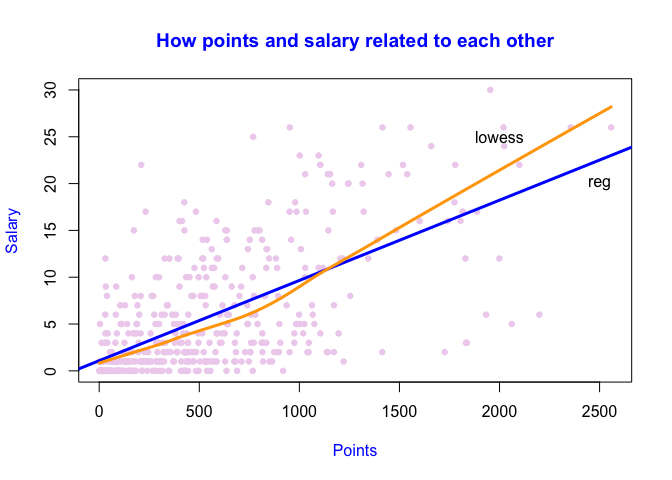

hw01-Site-Bai.Rmd
================
Site Bai
9/18/2017

1) A bit of data preprocessing.
===============================

``` r
load("data/nba2017-salary-points.RData")
salary <- round(salary/1000000,2)
mnbasalary <- salary
mnbasalary <- as.integer(mnbasalary)

is.integer(mnbasalary)
```

    ## [1] TRUE

``` r
experience1 <- replace(experience, experience=="R",0)
experience1 <- as.integer(experience1)
is.integer(experience1)
```

    ## [1] TRUE

``` r
vector('integer')
```

    ## integer(0)

``` r
library(plyr)
position1 <- revalue(position, c("C"="center","PF"="power_fwd","PG"="point_guard","SF"="small_fwd","SG"="shoot_guard"))
table(position1)
```

    ## position1
    ##      center point_guard   power_fwd shoot_guard   small_fwd 
    ##          89          85          89          95          83

2) Scatterplot of Points
========================

``` r
?plot
plot(points, mnbasalary, main="How points and salary related to each other",
     xlab="Points",
     ylab="Salary",
     col.main="blue",
     col.lab="blue",
     pch=19,
     cex=0.75,
     col="thistle2")
```


3)correlation between Points and salary.
========================================

``` r
summary(points)
```

    ##    Min. 1st Qu.  Median    Mean 3rd Qu.    Max. 
    ##     0.0   156.0   432.0   546.6   780.0  2558.0

``` r
n <- length(player)

X <- points
Y <- salary
x_bar =sum(X)/n
cat(x_bar)
```

    ## 546.6054

``` r
y_bar =sum(Y)/n
cat(y_bar)
```

    ## 6.186689

``` r
var_x =sum((X-x_bar)^2)/(n-1)
cat(var_x)
```

    ## 239136.2

``` r
var_y =sum((Y-y_bar)^2)/(n-1)
cat(var_y)
```

    ## 43.19524

``` r
sdx <- sqrt(var_x)
cat(sdx)
```

    ## 489.0156

``` r
cov_xy =sum((X-x_bar)*(Y-y_bar))/(n-1)
cat(cov_xy)
```

    ## 2046.424

``` r
sdy <- sqrt(var_y)

cat(sdy)
```

    ## 6.572309

``` r
cor_xy =cov_xy/(sdx*sdy)
cat(cor_xy)
```

    ## 0.6367296

4)Simple Linear Regression
==========================

``` r
b1 <- cor_xy*(sdy/sdx)
cat(b1)
```

    ## 0.008557567

``` r
b0 <- y_bar-b1*x_bar
cat(b0)
```

    ## 1.509077

``` r
y_hat =b0+b1*X

summary(y_hat)
```

    ##    Min. 1st Qu.  Median    Mean 3rd Qu.    Max. 
    ##   1.509   2.844   5.206   6.187   8.184  23.400

Intepretations: \* The intercept of the regression line is 1509886, which means that is the point a player get is 0, the salary of this player is 1509886.
\* The slope b1 shows that one unit change in points leads to 8556.681 increase in salary Regression Equation:
$$ \\hat{Y}=1509886+8556.681\*X $$

``` r
y_hat1 =b0+b1*0
cat(y_hat1)
```

    ## 1.509077

``` r
y_hat2 =b0+b1*100
cat(y_hat2)
```

    ## 2.364833

``` r
y_hat3 =b0+b1*500
cat(y_hat3)
```

    ## 5.78786

``` r
y_hat4=b0+b1*1000
cat(y_hat4)
```

    ## 10.06664

``` r
y_hat5 =b0+b1*2000
cat(y_hat5)
```

    ## 18.62421

5)Plotting the regression line
==============================

``` r
?abline
reg <- lm(mnbasalary~points)
plot(points, mnbasalary, main="How points and salary related to each other",
     xlab="Points",
     ylab="Salary",
     col.main="blue",
     col.lab="blue",
     col="thistle2",
     pch=19,
     cex=0.75)
abline(reg,col="blue",lwd=3)
lines(lowess(points,mnbasalary),col="orange",lwd=3)

text(c(2500,2000),c(20,25),labels=c("reg","lowess"))
```

 Regression residuals and coefficient of Determination $ R^2 $
$$ ei=Yi-\\hat{Y} $$
 \# 6) Regression residuals and Coefficient of Determination
*R*<sup>2</sup>

``` r
residuals <- Y-y_hat
rss =sum((residuals)^2)
tss =sum((Y-y_bar)^2)
Rsquare <- 1-(rss/tss)
Rsquare
```

    ## [1] 0.4054246

7)
==

a)Exploring Positionn and Experience
------------------------------------

``` r
reg1 <- lm(salary~experience)
plot(experience1,salary,col="tan1")
lines(lowess(experience1,salary),col="slateblue",lwd=5)
```


b)scatter3d plot
----------------

``` r
library(scatterplot3d)
scatterplot3d(points, experience1, mnbasalary,
              xlab="Points",
              ylab="Years of Experience",
              angle=55,
              color="plum3",
main="3D-Scatterplot 1") 
```


c)boxplot
---------

``` r
boxplot(mnbasalary~position1,
        xlab="Position",
        ylab="Salary(in millions)",
        varwidth=TRUE,
        col=c("lightpink1","khaki"),
        main="Boxplot1 for NBA") 
```


-   From the scartterplots, experiences seem not to be related with positions because they are not stongly related. Interpretation about boxplot.
-   From the boxplots, they show that maxmum salary vary from avery position, but thay share same minimum salary. And most importantly, they have same average salary for every positions.Therefore, positions seem not to be related with salary.

8 Comments and reflections.
===========================

-   Interpretation parts are hard to me because I m not sure what I interpreted is correct or not. Also, I lost my working directory many tims.
-   Customizing plots are very enjoyable fo me casue I have control over R.
-   I spent almost 8hours to complete this hw and I think I have learned a lot from this homework.
-   I do need help for this assignment. For example, the path I am loading data is different with the directory I am working at, so I needed to ask GSI. Also, I googled a lot looking for how to use a specific syntax for hw.
-   The most time consuming part is part (3) becasue I did all calculations manually. And it took me a while to understand what questions are asking me to do.
-   For part (7),I am not sure how to interpret plots properly.
-   Yes, everytime when my R markdown tells me that the file cannnot be knitted and I have no idea what I should do to knit successfully
-   To be honest,I completed this assignment almost by myself without discussing with classmates and I found that I could use R to do homeworks given by my other classes, which make me very excited.
