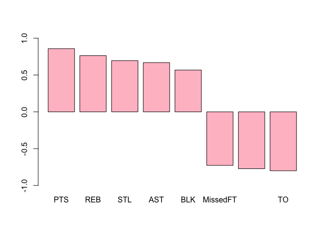
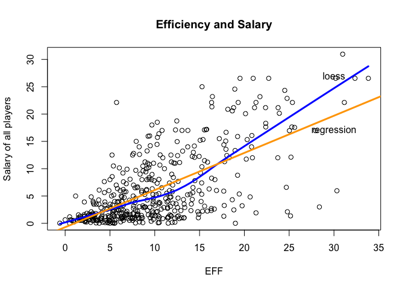

hw02-Site-Bai.Rmd
================
Site Bai
9/28/2017

-   **Manipulating R.csv.**

``` r
NBA17base <- read.csv('nba2017-player-statistics.csv',colClasses = c("character","character","factor","character","double","integer",rep('integer',18)))

str(NBA17base)
```

    ## 'data.frame':    441 obs. of  24 variables:
    ##  $ Player      : chr  "Al Horford" "Amir Johnson" "Avery Bradley" "Demetrius Jackson" ...
    ##  $ Team        : chr  "BOS" "BOS" "BOS" "BOS" ...
    ##  $ Position    : Factor w/ 5 levels "C","PF","PG",..: 1 2 5 3 4 3 4 5 4 2 ...
    ##  $ Experience  : chr  "9" "11" "6" "R" ...
    ##  $ Salary      : num  26540100 12000000 8269663 1450000 1410598 ...
    ##  $ Rank        : int  4 6 5 15 11 1 3 13 8 10 ...
    ##  $ Age         : int  30 29 26 22 31 27 26 21 20 29 ...
    ##  $ GP          : int  68 80 55 5 47 76 72 29 78 78 ...
    ##  $ GS          : int  68 77 55 0 0 76 72 0 20 6 ...
    ##  $ MIN         : int  2193 1608 1835 17 538 2569 2335 220 1341 1232 ...
    ##  $ FGM         : int  379 213 359 3 95 682 333 25 192 114 ...
    ##  $ FGA         : int  801 370 775 4 232 1473 720 58 423 262 ...
    ##  $ Points3     : int  86 27 108 1 39 245 157 12 46 45 ...
    ##  $ Points3_atts: int  242 66 277 1 111 646 394 35 135 130 ...
    ##  $ Points2     : int  293 186 251 2 56 437 176 13 146 69 ...
    ##  $ Points2_atts: int  559 304 498 3 121 827 326 23 288 132 ...
    ##  $ FTM         : int  108 67 68 3 33 590 176 6 85 26 ...
    ##  $ FTA         : int  135 100 93 6 41 649 217 9 124 37 ...
    ##  $ OREB        : int  95 117 65 2 17 43 48 6 45 60 ...
    ##  $ DREB        : int  369 248 269 2 68 162 367 20 175 213 ...
    ##  $ AST         : int  337 140 121 3 33 449 155 4 64 71 ...
    ##  $ STL         : int  52 52 68 0 9 70 72 10 35 26 ...
    ##  $ BLK         : int  87 62 11 0 7 13 23 2 18 17 ...
    ##  $ TO          : int  116 77 88 0 25 210 79 4 68 39 ...

``` r
is.factor(NBA17base$Position)
```

    ## [1] TRUE

-   **Manipulating R\_csv.**

``` r
nba17readr <- read_csv('nba2017-player-statistics.csv')
```

    ## Parsed with column specification:
    ## cols(
    ##   .default = col_integer(),
    ##   Player = col_character(),
    ##   Team = col_character(),
    ##   Position = col_character(),
    ##   Experience = col_character(),
    ##   Salary = col_double()
    ## )

    ## See spec(...) for full column specifications.

``` r
spec(nba17readr)
```

    ## cols(
    ##   Player = col_character(),
    ##   Team = col_character(),
    ##   Position = col_character(),
    ##   Experience = col_character(),
    ##   Salary = col_double(),
    ##   Rank = col_integer(),
    ##   Age = col_integer(),
    ##   GP = col_integer(),
    ##   GS = col_integer(),
    ##   MIN = col_integer(),
    ##   FGM = col_integer(),
    ##   FGA = col_integer(),
    ##   Points3 = col_integer(),
    ##   Points3_atts = col_integer(),
    ##   Points2 = col_integer(),
    ##   Points2_atts = col_integer(),
    ##   FTM = col_integer(),
    ##   FTA = col_integer(),
    ##   OREB = col_integer(),
    ##   DREB = col_integer(),
    ##   AST = col_integer(),
    ##   STL = col_integer(),
    ##   BLK = col_integer(),
    ##   TO = col_integer()
    ## )

``` r
nba17readr$Position <- factor(nba17readr$Position)
is.factor(nba17readr$Position)
```

    ## [1] TRUE

``` r
nba17readr <- read_csv('nba2017-player-statistics.csv',col_types =list(Player = col_character(),
                Team = col_character(),
                Position=col_factor(c("C","PF","PG","SG","SF")),
                Experience=col_character(),
                Salary=col_double(),
                 Rank = col_integer(),
                Age = col_integer(),
                GP = col_integer(),
                GS = col_integer(),
                MIN = col_integer(),
                FGM = col_integer(),
                FGA = col_integer(),
                Points3 = col_integer(),
                Points3_atts = col_integer(),
                Points2 = col_integer(),
                Points2_atts = col_integer(),
                FTM = col_integer(),
                FTA = col_integer(),
                OREB = col_integer(),
                DREB = col_integer(),
                AST = col_integer(),
                STL = col_integer(),
                BLK = col_integer(),
                TO = col_integer()
                      ) )
str(nba17readr)
```

    ## Classes 'tbl_df', 'tbl' and 'data.frame':    441 obs. of  24 variables:
    ##  $ Player      : chr  "Al Horford" "Amir Johnson" "Avery Bradley" "Demetrius Jackson" ...
    ##  $ Team        : chr  "BOS" "BOS" "BOS" "BOS" ...
    ##  $ Position    : Factor w/ 5 levels "C","PF","PG",..: 1 2 4 3 5 3 5 4 5 2 ...
    ##  $ Experience  : chr  "9" "11" "6" "R" ...
    ##  $ Salary      : num  26540100 12000000 8269663 1450000 1410598 ...
    ##  $ Rank        : int  4 6 5 15 11 1 3 13 8 10 ...
    ##  $ Age         : int  30 29 26 22 31 27 26 21 20 29 ...
    ##  $ GP          : int  68 80 55 5 47 76 72 29 78 78 ...
    ##  $ GS          : int  68 77 55 0 0 76 72 0 20 6 ...
    ##  $ MIN         : int  2193 1608 1835 17 538 2569 2335 220 1341 1232 ...
    ##  $ FGM         : int  379 213 359 3 95 682 333 25 192 114 ...
    ##  $ FGA         : int  801 370 775 4 232 1473 720 58 423 262 ...
    ##  $ Points3     : int  86 27 108 1 39 245 157 12 46 45 ...
    ##  $ Points3_atts: int  242 66 277 1 111 646 394 35 135 130 ...
    ##  $ Points2     : int  293 186 251 2 56 437 176 13 146 69 ...
    ##  $ Points2_atts: int  559 304 498 3 121 827 326 23 288 132 ...
    ##  $ FTM         : int  108 67 68 3 33 590 176 6 85 26 ...
    ##  $ FTA         : int  135 100 93 6 41 649 217 9 124 37 ...
    ##  $ OREB        : int  95 117 65 2 17 43 48 6 45 60 ...
    ##  $ DREB        : int  369 248 269 2 68 162 367 20 175 213 ...
    ##  $ AST         : int  337 140 121 3 33 449 155 4 64 71 ...
    ##  $ STL         : int  52 52 68 0 9 70 72 10 35 26 ...
    ##  $ BLK         : int  87 62 11 0 7 13 23 2 18 17 ...
    ##  $ TO          : int  116 77 88 0 25 210 79 4 68 39 ...
    ##  - attr(*, "spec")=List of 2
    ##   ..$ cols   :List of 24
    ##   .. ..$ Player      : list()
    ##   .. .. ..- attr(*, "class")= chr  "collector_character" "collector"
    ##   .. ..$ Team        : list()
    ##   .. .. ..- attr(*, "class")= chr  "collector_character" "collector"
    ##   .. ..$ Position    :List of 3
    ##   .. .. ..$ levels    : chr  "C" "PF" "PG" "SG" ...
    ##   .. .. ..$ ordered   : logi FALSE
    ##   .. .. ..$ include_na: logi FALSE
    ##   .. .. ..- attr(*, "class")= chr  "collector_factor" "collector"
    ##   .. ..$ Experience  : list()
    ##   .. .. ..- attr(*, "class")= chr  "collector_character" "collector"
    ##   .. ..$ Salary      : list()
    ##   .. .. ..- attr(*, "class")= chr  "collector_double" "collector"
    ##   .. ..$ Rank        : list()
    ##   .. .. ..- attr(*, "class")= chr  "collector_integer" "collector"
    ##   .. ..$ Age         : list()
    ##   .. .. ..- attr(*, "class")= chr  "collector_integer" "collector"
    ##   .. ..$ GP          : list()
    ##   .. .. ..- attr(*, "class")= chr  "collector_integer" "collector"
    ##   .. ..$ GS          : list()
    ##   .. .. ..- attr(*, "class")= chr  "collector_integer" "collector"
    ##   .. ..$ MIN         : list()
    ##   .. .. ..- attr(*, "class")= chr  "collector_integer" "collector"
    ##   .. ..$ FGM         : list()
    ##   .. .. ..- attr(*, "class")= chr  "collector_integer" "collector"
    ##   .. ..$ FGA         : list()
    ##   .. .. ..- attr(*, "class")= chr  "collector_integer" "collector"
    ##   .. ..$ Points3     : list()
    ##   .. .. ..- attr(*, "class")= chr  "collector_integer" "collector"
    ##   .. ..$ Points3_atts: list()
    ##   .. .. ..- attr(*, "class")= chr  "collector_integer" "collector"
    ##   .. ..$ Points2     : list()
    ##   .. .. ..- attr(*, "class")= chr  "collector_integer" "collector"
    ##   .. ..$ Points2_atts: list()
    ##   .. .. ..- attr(*, "class")= chr  "collector_integer" "collector"
    ##   .. ..$ FTM         : list()
    ##   .. .. ..- attr(*, "class")= chr  "collector_integer" "collector"
    ##   .. ..$ FTA         : list()
    ##   .. .. ..- attr(*, "class")= chr  "collector_integer" "collector"
    ##   .. ..$ OREB        : list()
    ##   .. .. ..- attr(*, "class")= chr  "collector_integer" "collector"
    ##   .. ..$ DREB        : list()
    ##   .. .. ..- attr(*, "class")= chr  "collector_integer" "collector"
    ##   .. ..$ AST         : list()
    ##   .. .. ..- attr(*, "class")= chr  "collector_integer" "collector"
    ##   .. ..$ STL         : list()
    ##   .. .. ..- attr(*, "class")= chr  "collector_integer" "collector"
    ##   .. ..$ BLK         : list()
    ##   .. .. ..- attr(*, "class")= chr  "collector_integer" "collector"
    ##   .. ..$ TO          : list()
    ##   .. .. ..- attr(*, "class")= chr  "collector_integer" "collector"
    ##   ..$ default: list()
    ##   .. ..- attr(*, "class")= chr  "collector_guess" "collector"
    ##   ..- attr(*, "class")= chr "col_spec"

-   **Right after importing the data.**

``` r
NBA17base$Experience[NBA17base$Experience=="R"] <- "0"
NBA17base$Experience <- as.integer(NBA17base$Experience)
NBA17base$Experience
```

    ##   [1]  9 11  6  0  9  5  4  2  0  6  1  3  2  1  4 10 12 11  5  1  5 12 13
    ##  [24]  0  8 13  5 13 15  5  2  5  1  7  7  0  0  4 10  2  1  5  0  6  7  2
    ##  [47]  4  7  1  0  8  8  6  9  5  3  0  0  3  0  3 12  8 11  4 12  0 14  3
    ##  [70] 10  3 10  3  3  6  2 17  4  4  0  3  8  4  1  9  0  3  8 12 11  0  7
    ##  [93]  1  6  6  5 11  1  6  1  9  8  1  1  1  0 13  3  1  5  2  3  2  0 10
    ## [116]  8  4  8  4  7  9  1  1  6  0  0  2 13  7  1  4  4 12  1  1  0  6  5
    ## [139]  3  5  0  3  5  1  5  4  1  1  3  1  4  2  5  9 11  4  4  8  9  0 13
    ## [162]  0  8  7  9  3  1  4  5  0  0  0  0  9  0  2  5  9  8  2  2  4  8  7
    ## [185]  0  1  5  0  0  4  0  0  7  1  8  0  1  2  1  3  4  0  1  6  0  4  3
    ## [208]  8  0  0  6  2  2  2  4 10  1  2  2  6 12  0 13  4  3  2  8  9  1  5
    ## [231] 13  0 11  7 13  0  7 11  0  0  3  9  1  5  2 10 14  7 15 15  2  0  2
    ## [254]  8  0  7  0 11  1  4  8  1 12  0  7  4  6 11  0 11  8  0 10 16  8  8
    ## [277] 18 11  6  5 13  1  6  8  6  3  2 15  0  1  2  3  5  1  0  3  0  2  5
    ## [300]  2  1  4 12  5  8  0  3  7  3  0  8  5  0  2  2  1  8  9 12  3 18  0
    ## [323]  0 15  6  3  3  4  6  6  0  2  4  4  2  1  2  0  7  7  1  2  0 12  0
    ## [346]  5  0  3 16  1  8  4  8  6  4  1  0  7  6  4  5  4  7  6  0  3  2  0
    ## [369]  3 12 18  0  2  4 10  0  2  0  1  3  7  0  8  9  3  0  7  6  0  8  2
    ## [392]  0 10  0  7  7  1  2  2  8  6  3  7  1  0  1  7  5  3  1  2  0  9  1
    ## [415]  0  0  2  2  1 12 16  9  2  4  6  2  1  3  5  0  1  0  2  6  9 13  0
    ## [438] 11  2  0 15

-   **Performance of players.**

``` r
PTS =NBA17base$Points3*3+NBA17base$Points2*2+
  NBA17base$FTM*1
Rebounds =NBA17base$OREB+NBA17base$DREB
MissedFG =NBA17base$FGA-NBA17base$FGM
MissedFT =NBA17base$FTA-NBA17base$FTM
Ast = NBA17base$AST
Stl =NBA17base$STL
BLK= NBA17base$BLK
To= NBA17base$TO
Gp  = NBA17base$GP

EFF=(PTS+Rebounds+Ast+Stl+BLK-MissedFG-MissedFT-To)/Gp
summary(EFF)
```

    ##    Min. 1st Qu.  Median    Mean 3rd Qu.    Max. 
    ##  -0.600   5.452   9.090  10.140  13.250  33.840

-   **Display the player name,team, salary and EFF value of the top 10 players in decreasing order. **

``` r
NBA17base <- mutate(NBA17base,eff=EFF)
select(slice(arrange(NBA17base,desc(eff)),1:10),Player,eff)
```

    ## # A tibble: 10 x 2
    ##                   Player      eff
    ##                    <chr>    <dbl>
    ##  1     Russell Westbrook 33.83951
    ##  2          James Harden 32.34568
    ##  3         Anthony Davis 31.16000
    ##  4          LeBron James 30.97297
    ##  5    Karl-Anthony Towns 30.32927
    ##  6          Kevin Durant 30.19355
    ##  7 Giannis Antetokounmpo 28.37500
    ##  8      DeMarcus Cousins 27.94118
    ##  9          Jimmy Butler 25.60526
    ## 10      Hassan Whiteside 25.36364

-   **Provide the names of the players that have a negative EFF**

``` r
select(filter(NBA17base,eff <0),Player)
```

    ##            Player
    ## 1 Patricio Garino

-   **Use the function cor() to compute the correlation coefficients between EFF and all the variables used in the EFF formula.**

``` r
c1 <- cor(EFF,PTS)
c2 <- cor(EFF,Rebounds)
c3 <- cor(EFF,NBA17base$AST)
c4 <- cor(EFF,NBA17base$STL)
c5 <- cor(EFF,NBA17base$BLK)
c6 <- cor(EFF,-MissedFG)
c7 <- cor(EFF,-MissedFT)
c8 <- cor(EFF,-NBA17base$TO)
corr <- c(c1,c2,c3,c4,c5,c6,c7,c8)
corr <- sort(corr,decreasing = TRUE)
barplot(corr,names.arg =c( "PTS","REB","STL","AST","BLK","MissedFT","MissedFG","TO"),col="pink",ylim =c(-1,1))
```



-   **Efficiency and salary.**

``` r
NBA17base$Salary <- round(NBA17base$Salary/1000000,2)
plot(EFF,NBA17base$Salary,
     ylab = "Salary of all players",
     main = "Efficiency and Salary")
lines(lowess(EFF,NBA17base$Salary),lwd=3,col="blue")
reg_SE <- lm(NBA17base$Salary~EFF)
abline(reg_SE,col="orange",lwd=3)
text(c(30,30),c(27,17),labels=c("loess","regression"))
```


-   **Why NBA stars get paid so much more than NFL stars.**

``` r
NBA17base <- mutate(NBA17base,mpg=MIN/GP)
players2 <- select(filter(NBA17base,mpg>20),Player,eff,Salary)
is.data.frame(players2)
```

    ## [1] TRUE

``` r
plot(players2$eff,players2$Salary,xlab="More estblished players",
      ylab="Salary",
     main = "Players2 and Salary")
lines(lowess(players2$eff,players2$Salary),lwd=3,col="green")
reg_P2 <- lm(players2$Salary~players2$eff)
abline(reg_P2,lwd=3,col="pink")
```



-   **What can you say about the relationship between these two variables for the set og "more established players?**

-   According to the y\_hat =b0+b1\*X, the b1 of the correlation between salary and the Eff of more established players is 0.69, which is slightly greater than 0.68, the b1 of the correlation between salary and EFF of all players. This means that those who play 20minutes or more per game get paied a little bit higher than those who do not.

-   **Comments and reflections.**
-   `I had a problem with knitting the file because I made a typo in the beginning, which made me spending more than 3 hours to figure out which part is wrong. Finally, I knitted my file successfully.`
-   `I need help for this assignment and I learned the different using of histogram and barplot from online source`
-   `Overall I spent 7 hours to finish this assignment`
-   `The most time-consuming part and frastrating part for me is knitting the file`
-   `The most exciting part of this assignment is that I could figure out all problems I met if I have enough time`
