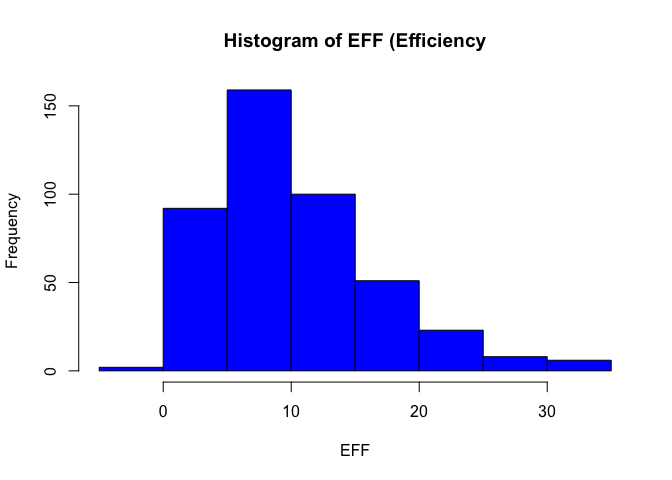
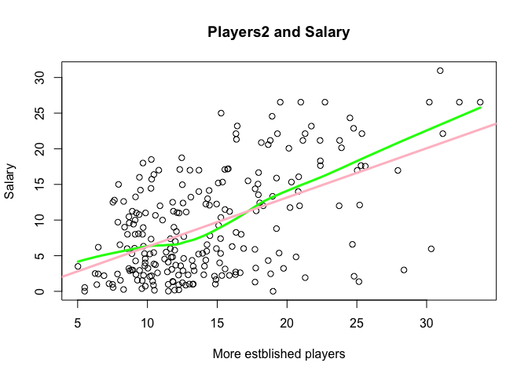

hw02-Site-Bai.Rmd
================
Site Bai
9/28/2017

``` r
library(readr)
library(dplyr)
```

    ## 
    ## Attaching package: 'dplyr'

    ## The following objects are masked from 'package:stats':
    ## 
    ##     filter, lag

    ## The following objects are masked from 'package:base':
    ## 
    ##     intersect, setdiff, setequal, union

-   **Manipulating R.csv.**

``` r
getwd()
```

    ## [1] "/Users/baibai/stat133/stat133-hws-fall17/hw02"

``` r
setwd("/Users/baibai/stat133/stat133-hws-fall17/hw02/data")
NBA17base <- read.csv('nba2017-player-statistics.csv',colClasses = c('character','character','factor','character','real',rep('integer',19)))
```

-   **Manipulating R\_csv.**

``` r
setwd("/Users/baibai/stat133/stat133-hws-fall17/hw02/data")
nba17readr <- read_csv('nba2017-player-statistics.csv')
```

    ## Parsed with column specification:
    ## cols(
    ##   .default = col_integer(),
    ##   Player = col_character(),
    ##   Team = col_character(),
    ##   Position = col_character(),
    ##   Experience = col_character(),
    ##   Salary = col_double()
    ## )

    ## See spec(...) for full column specifications.

``` r
spec(nba17readr)
```

    ## cols(
    ##   Player = col_character(),
    ##   Team = col_character(),
    ##   Position = col_character(),
    ##   Experience = col_character(),
    ##   Salary = col_double(),
    ##   Rank = col_integer(),
    ##   Age = col_integer(),
    ##   GP = col_integer(),
    ##   GS = col_integer(),
    ##   MIN = col_integer(),
    ##   FGM = col_integer(),
    ##   FGA = col_integer(),
    ##   Points3 = col_integer(),
    ##   Points3_atts = col_integer(),
    ##   Points2 = col_integer(),
    ##   Points2_atts = col_integer(),
    ##   FTM = col_integer(),
    ##   FTA = col_integer(),
    ##   OREB = col_integer(),
    ##   DREB = col_integer(),
    ##   AST = col_integer(),
    ##   STL = col_integer(),
    ##   BLK = col_integer(),
    ##   TO = col_integer()
    ## )

``` r
nba17readr$Position <- factor(nba17readr$Position)
is.factor(nba17readr$Position)
```

    ## [1] TRUE

``` r
nba17readr <- read_csv('nba2017-player-statistics.csv',col_types =list(Player = col_character(),
                Team = col_character(),
                Position=col_factor(c("C","PF","PG","SG","SF")),
                Experience=col_character(),
                Salary=col_double(),
                 Rank = col_integer(),
                Age = col_integer(),
                GP = col_integer(),
                GS = col_integer(),
                MIN = col_integer(),
                FGM = col_integer(),
                FGA = col_integer(),
                Points3 = col_integer(),
                Points3_atts = col_integer(),
                Points2 = col_integer(),
                Points2_atts = col_integer(),
                FTM = col_integer(),
                FTA = col_integer(),
                OREB = col_integer(),
                DREB = col_integer(),
                AST = col_integer(),
                STL = col_integer(),
                BLK = col_integer(),
                TO = col_integer()
                      ) )
str(nba17readr)
```

    ## Classes 'tbl_df', 'tbl' and 'data.frame':    441 obs. of  24 variables:
    ##  $ Player      : chr  "Al Horford" "Amir Johnson" "Avery Bradley" "Demetrius Jackson" ...
    ##  $ Team        : chr  "BOS" "BOS" "BOS" "BOS" ...
    ##  $ Position    : Factor w/ 5 levels "C","PF","PG",..: 1 2 4 3 5 3 5 4 5 2 ...
    ##  $ Experience  : chr  "9" "11" "6" "R" ...
    ##  $ Salary      : num  26540100 12000000 8269663 1450000 1410598 ...
    ##  $ Rank        : int  4 6 5 15 11 1 3 13 8 10 ...
    ##  $ Age         : int  30 29 26 22 31 27 26 21 20 29 ...
    ##  $ GP          : int  68 80 55 5 47 76 72 29 78 78 ...
    ##  $ GS          : int  68 77 55 0 0 76 72 0 20 6 ...
    ##  $ MIN         : int  2193 1608 1835 17 538 2569 2335 220 1341 1232 ...
    ##  $ FGM         : int  379 213 359 3 95 682 333 25 192 114 ...
    ##  $ FGA         : int  801 370 775 4 232 1473 720 58 423 262 ...
    ##  $ Points3     : int  86 27 108 1 39 245 157 12 46 45 ...
    ##  $ Points3_atts: int  242 66 277 1 111 646 394 35 135 130 ...
    ##  $ Points2     : int  293 186 251 2 56 437 176 13 146 69 ...
    ##  $ Points2_atts: int  559 304 498 3 121 827 326 23 288 132 ...
    ##  $ FTM         : int  108 67 68 3 33 590 176 6 85 26 ...
    ##  $ FTA         : int  135 100 93 6 41 649 217 9 124 37 ...
    ##  $ OREB        : int  95 117 65 2 17 43 48 6 45 60 ...
    ##  $ DREB        : int  369 248 269 2 68 162 367 20 175 213 ...
    ##  $ AST         : int  337 140 121 3 33 449 155 4 64 71 ...
    ##  $ STL         : int  52 52 68 0 9 70 72 10 35 26 ...
    ##  $ BLK         : int  87 62 11 0 7 13 23 2 18 17 ...
    ##  $ TO          : int  116 77 88 0 25 210 79 4 68 39 ...
    ##  - attr(*, "spec")=List of 2
    ##   ..$ cols   :List of 24
    ##   .. ..$ Player      : list()
    ##   .. .. ..- attr(*, "class")= chr  "collector_character" "collector"
    ##   .. ..$ Team        : list()
    ##   .. .. ..- attr(*, "class")= chr  "collector_character" "collector"
    ##   .. ..$ Position    :List of 3
    ##   .. .. ..$ levels    : chr  "C" "PF" "PG" "SG" ...
    ##   .. .. ..$ ordered   : logi FALSE
    ##   .. .. ..$ include_na: logi FALSE
    ##   .. .. ..- attr(*, "class")= chr  "collector_factor" "collector"
    ##   .. ..$ Experience  : list()
    ##   .. .. ..- attr(*, "class")= chr  "collector_character" "collector"
    ##   .. ..$ Salary      : list()
    ##   .. .. ..- attr(*, "class")= chr  "collector_double" "collector"
    ##   .. ..$ Rank        : list()
    ##   .. .. ..- attr(*, "class")= chr  "collector_integer" "collector"
    ##   .. ..$ Age         : list()
    ##   .. .. ..- attr(*, "class")= chr  "collector_integer" "collector"
    ##   .. ..$ GP          : list()
    ##   .. .. ..- attr(*, "class")= chr  "collector_integer" "collector"
    ##   .. ..$ GS          : list()
    ##   .. .. ..- attr(*, "class")= chr  "collector_integer" "collector"
    ##   .. ..$ MIN         : list()
    ##   .. .. ..- attr(*, "class")= chr  "collector_integer" "collector"
    ##   .. ..$ FGM         : list()
    ##   .. .. ..- attr(*, "class")= chr  "collector_integer" "collector"
    ##   .. ..$ FGA         : list()
    ##   .. .. ..- attr(*, "class")= chr  "collector_integer" "collector"
    ##   .. ..$ Points3     : list()
    ##   .. .. ..- attr(*, "class")= chr  "collector_integer" "collector"
    ##   .. ..$ Points3_atts: list()
    ##   .. .. ..- attr(*, "class")= chr  "collector_integer" "collector"
    ##   .. ..$ Points2     : list()
    ##   .. .. ..- attr(*, "class")= chr  "collector_integer" "collector"
    ##   .. ..$ Points2_atts: list()
    ##   .. .. ..- attr(*, "class")= chr  "collector_integer" "collector"
    ##   .. ..$ FTM         : list()
    ##   .. .. ..- attr(*, "class")= chr  "collector_integer" "collector"
    ##   .. ..$ FTA         : list()
    ##   .. .. ..- attr(*, "class")= chr  "collector_integer" "collector"
    ##   .. ..$ OREB        : list()
    ##   .. .. ..- attr(*, "class")= chr  "collector_integer" "collector"
    ##   .. ..$ DREB        : list()
    ##   .. .. ..- attr(*, "class")= chr  "collector_integer" "collector"
    ##   .. ..$ AST         : list()
    ##   .. .. ..- attr(*, "class")= chr  "collector_integer" "collector"
    ##   .. ..$ STL         : list()
    ##   .. .. ..- attr(*, "class")= chr  "collector_integer" "collector"
    ##   .. ..$ BLK         : list()
    ##   .. .. ..- attr(*, "class")= chr  "collector_integer" "collector"
    ##   .. ..$ TO          : list()
    ##   .. .. ..- attr(*, "class")= chr  "collector_integer" "collector"
    ##   ..$ default: list()
    ##   .. ..- attr(*, "class")= chr  "collector_guess" "collector"
    ##   ..- attr(*, "class")= chr "col_spec"

-   **Right after importing the data.**

``` r
NBA17base$Experience[NBA17base$Experience=="R"] <- "0"
NBA17base$Experience <- as.integer(NBA17base$Experience)
NBA17base$Experience
```

    ##   [1]  9 11  6  0  9  5  4  2  0  6  1  3  2  1  4 10 12 11  5  1  5 12 13
    ##  [24]  0  8 13  5 13 15  5  2  5  1  7  7  0  0  4 10  2  1  5  0  6  7  2
    ##  [47]  4  7  1  0  8  8  6  9  5  3  0  0  3  0  3 12  8 11  4 12  0 14  3
    ##  [70] 10  3 10  3  3  6  2 17  4  4  0  3  8  4  1  9  0  3  8 12 11  0  7
    ##  [93]  1  6  6  5 11  1  6  1  9  8  1  1  1  0 13  3  1  5  2  3  2  0 10
    ## [116]  8  4  8  4  7  9  1  1  6  0  0  2 13  7  1  4  4 12  1  1  0  6  5
    ## [139]  3  5  0  3  5  1  5  4  1  1  3  1  4  2  5  9 11  4  4  8  9  0 13
    ## [162]  0  8  7  9  3  1  4  5  0  0  0  0  9  0  2  5  9  8  2  2  4  8  7
    ## [185]  0  1  5  0  0  4  0  0  7  1  8  0  1  2  1  3  4  0  1  6  0  4  3
    ## [208]  8  0  0  6  2  2  2  4 10  1  2  2  6 12  0 13  4  3  2  8  9  1  5
    ## [231] 13  0 11  7 13  0  7 11  0  0  3  9  1  5  2 10 14  7 15 15  2  0  2
    ## [254]  8  0  7  0 11  1  4  8  1 12  0  7  4  6 11  0 11  8  0 10 16  8  8
    ## [277] 18 11  6  5 13  1  6  8  6  3  2 15  0  1  2  3  5  1  0  3  0  2  5
    ## [300]  2  1  4 12  5  8  0  3  7  3  0  8  5  0  2  2  1  8  9 12  3 18  0
    ## [323]  0 15  6  3  3  4  6  6  0  2  4  4  2  1  2  0  7  7  1  2  0 12  0
    ## [346]  5  0  3 16  1  8  4  8  6  4  1  0  7  6  4  5  4  7  6  0  3  2  0
    ## [369]  3 12 18  0  2  4 10  0  2  0  1  3  7  0  8  9  3  0  7  6  0  8  2
    ## [392]  0 10  0  7  7  1  2  2  8  6  3  7  1  0  1  7  5  3  1  2  0  9  1
    ## [415]  0  0  2  2  1 12 16  9  2  4  6  2  1  3  5  0  1  0  2  6  9 13  0
    ## [438] 11  2  0 15

-   **Performance of players.**

``` r
PTS =NBA17base$Points3*3+NBA17base$Points2*2+
  NBA17base$FTM*1
Rebounds =NBA17base$OREB+NBA17base$DREB
MissedFG =NBA17base$FGA-NBA17base$FGM
MissedFT =NBA17base$FTA-NBA17base$FTM
Ast = NBA17base$AST
Stl =NBA17base$STL
BLK= NBA17base$BLK
To= NBA17base$TO
Gp  = NBA17base$GP

EFF=(PTS+Rebounds+Ast+Stl+BLK-MissedFG-MissedFT-To)/Gp
summary(EFF)
```

    ##    Min. 1st Qu.  Median    Mean 3rd Qu.    Max. 
    ##  -0.600   5.452   9.090  10.140  13.250  33.840

``` r
hist(EFF,main = "Histogram of EFF (Efficiency",col = "blue")
```

 \* **Display the player name,team, salary and EFF value of the top 10 players in decreasing order. **

``` r
NBA17base <- mutate(NBA17base,eff=EFF)
select(slice(arrange(NBA17base,desc(eff)),1:10),Player,eff)
```

    ## # A tibble: 10 x 2
    ##                   Player      eff
    ##                    <chr>    <dbl>
    ##  1     Russell Westbrook 33.83951
    ##  2          James Harden 32.34568
    ##  3         Anthony Davis 31.16000
    ##  4          LeBron James 30.97297
    ##  5    Karl-Anthony Towns 30.32927
    ##  6          Kevin Durant 30.19355
    ##  7 Giannis Antetokounmpo 28.37500
    ##  8      DeMarcus Cousins 27.94118
    ##  9          Jimmy Butler 25.60526
    ## 10      Hassan Whiteside 25.36364

-   **Provide the names of the players that have a negative EFF**

``` r
select(filter(NBA17base,eff <0),Player)
```

    ##            Player
    ## 1 Patricio Garino

-   **Use the function cor() to compute the correlation coefficients between EFF and all the variables used in the EFF formula.**

``` r
c1 <- cor(EFF,PTS)
c2 <- cor(EFF,Rebounds)
c3 <- cor(EFF,NBA17base$AST)
c4 <- cor(EFF,NBA17base$STL)
c5 <- cor(EFF,NBA17base$BLK)
c6 <- cor(EFF,-MissedFG)
c7 <- cor(EFF,-MissedFT)
c8 <- cor(EFF,-NBA17base$TO)
corr <- c(c1,c2,c3,c4,c5,c6,c7,c8)
corr <- sort(corr,decreasing = TRUE)
barplot(corr,names.arg =c( "PTS","REB","STL","AST","BLK","MissedFT","MissedFG","TO"),col="pink",ylim =c(-1,1))
```


-   **Efficiency and salary.**

``` r
NBA17base$Salary <- round(NBA17base$Salary/1000000,2)
plot(EFF,NBA17base$Salary,
     ylab = "Salary of all players",
     main = "Efficiency and Salary")
lines(lowess(EFF,NBA17base$Salary),lwd=3,col="blue")
reg_SE <- lm(NBA17base$Salary~EFF)
abline(reg_SE,col="orange",lwd=3)
text(c(30,30),c(27,17),labels=c("loess","regression"))
```


-   **Why NBA stars get paid so much more than NFL stars.**

``` r
NBA17base <- mutate(NBA17base,mpg=MIN/GP)
players2 <- select(filter(NBA17base,mpg>=20),Player,eff,Salary)

is.data.frame(players2)
```

    ## [1] TRUE

``` r
players2
```

    ##                       Player       eff Salary
    ## 1                 Al Horford 19.514706  26.54
    ## 2               Amir Johnson 10.900000  12.00
    ## 3              Avery Bradley 16.345455   8.27
    ## 4              Isaiah Thomas 24.684211   6.59
    ## 5                Jae Crowder 16.069444   6.29
    ## 6               Kelly Olynyk 11.746667   3.09
    ## 7               Marcus Smart 12.379747   3.58
    ## 8             Deron Williams  8.291667   0.26
    ## 9                Edy Tavares 19.000000   0.01
    ## 10             Iman Shumpert  7.881579   9.70
    ## 11                J.R. Smith  7.634146  12.80
    ## 12                Kevin Love 22.366667  21.17
    ## 13               Kyle Korver 10.171429   5.24
    ## 14              Kyrie Irving 22.388889  17.64
    ## 15              LeBron James 30.972973  30.96
    ## 16         Richard Jefferson  6.253165   2.50
    ## 17          Tristan Thompson 15.384615  15.33
    ## 18               Cory Joseph 10.262500   7.33
    ## 19             DeMar DeRozan 22.716216  26.54
    ## 20           DeMarre Carroll  9.500000  14.20
    ## 21         Jonas Valanciunas 17.712500  14.38
    ## 22                Kyle Lowry 23.733333  12.00
    ## 23               P.J. Tucker  9.791667   5.30
    ## 24         Patrick Patterson  9.076923   6.05
    ## 25               Serge Ibaka 14.956522  12.25
    ## 26          Bojan Bogdanovic 10.576923   3.73
    ## 27              Bradley Beal 19.311688  22.12
    ## 28                 John Wall 25.025641  16.96
    ## 29             Marcin Gortat 18.292683  12.00
    ## 30           Markieff Morris 15.236842   7.40
    ## 31               Otto Porter 17.700000   5.89
    ## 32           Dennis Schroder 16.316456   2.71
    ## 33             Dwight Howard 21.743243  23.18
    ## 34            Ersan Ilyasova 12.076923   8.40
    ## 35             Kent Bazemore 10.301370  15.73
    ## 36              Paul Millsap 20.130435  20.07
    ## 37           Thabo Sefolosha 10.467742   3.85
    ## 38              Tim Hardaway 12.227848   2.28
    ## 39     Giannis Antetokounmpo 28.375000   3.00
    ## 40               Greg Monroe 15.543210  17.10
    ## 41             Jabari Parker 19.431373   5.37
    ## 42           Khris Middleton 15.068966  15.20
    ## 43           Malcolm Brogdon 12.240000   0.92
    ## 44       Matthew Dellavedova  8.697368   9.61
    ## 45                Tony Snell  9.175000   2.37
    ## 46                C.J. Miles  9.842105   4.58
    ## 47               Jeff Teague 19.243902   8.80
    ## 48          Lance Stephenson  9.833333   4.00
    ## 49               Monta Ellis  9.405405  10.77
    ## 50              Myles Turner 18.827160   2.46
    ## 51               Paul George 22.386667  18.31
    ## 52            Thaddeus Young 14.418919  14.15
    ## 53               Dwyane Wade 16.433333  23.20
    ## 54              Jimmy Butler 25.605263  17.55
    ## 55            Nikola Mirotic 11.957143   5.78
    ## 56               Rajon Rondo 13.681159  14.00
    ## 57               Robin Lopez 13.111111  13.22
    ## 58              Dion Waiters 13.347826   2.90
    ## 59              Goran Dragic 19.246575  15.89
    ## 60          Hassan Whiteside 25.363636  22.12
    ## 61             James Johnson 15.171053   4.00
    ## 62           Josh Richardson 10.433962   0.87
    ## 63           Justise Winslow 10.722222   2.59
    ## 64           Rodney McGruder  7.538462   0.54
    ## 65             Tyler Johnson 14.246575   5.63
    ## 66           Wayne Ellington  8.548387   6.00
    ## 67            Andre Drummond 21.296296  22.12
    ## 68                 Ish Smith 11.641975   6.00
    ## 69                 Jon Leuer 12.266667  10.99
    ## 70  Kentavious Caldwell-Pope 12.026316   3.68
    ## 71             Marcus Morris 12.594937   4.62
    ## 72            Reggie Jackson 12.500000  14.96
    ## 73             Tobias Harris 15.792683  17.20
    ## 74               Cody Zeller 15.241935   5.32
    ## 75            Frank Kaminsky 11.426667   2.73
    ## 76              Kemba Walker 20.898734  12.00
    ## 77           Marco Belinelli  9.716216   6.33
    ## 78           Marvin Williams 14.184211  12.25
    ## 79    Michael Kidd-Gilchrist 14.308642  13.00
    ## 80             Nicolas Batum 18.155844  20.87
    ## 81           Carmelo Anthony 18.932432  24.56
    ## 82              Courtney Lee 11.857143  11.24
    ## 83              Derrick Rose 16.375000  21.32
    ## 84               Joakim Noah 13.043478  17.00
    ## 85        Kristaps Porzingis 18.651515   4.32
    ## 86              Lance Thomas  6.478261   6.19
    ## 87              Aaron Gordon 13.200000   4.35
    ## 88           Bismack Biyombo 10.814815  17.00
    ## 89             Elfrid Payton 16.646341   2.61
    ## 90             Evan Fournier 13.691176  17.00
    ## 91                Jeff Green  7.927536  15.00
    ## 92               Jodie Meeks  8.027778   6.54
    ## 93            Nikola Vucevic 20.213333  11.75
    ## 94             Terrence Ross 11.083333  10.00
    ## 95            Alex Poythress 11.500000   0.03
    ## 96               Dario Saric 12.913580   2.32
    ## 97          Gerald Henderson  8.361111   9.00
    ## 98             Jahlil Okafor 11.700000   4.79
    ## 99            Jerryd Bayless  9.000000   9.42
    ## 100              Joel Embiid 20.645161   4.83
    ## 101          Justin Anderson  9.625000   1.51
    ## 102             Nik Stauskas  8.862500   2.99
    ## 103           Richaun Holmes 13.280702   1.03
    ## 104         Robert Covington 14.865672   1.02
    ## 105         Sergio Rodriguez  9.117647   8.00
    ## 106           T.J. McConnell 12.740741   0.87
    ## 107              Brook Lopez 18.800000  21.17
    ## 108             Caris LeVert  9.280702   1.56
    ## 109         Isaiah Whitehead  7.246575   1.07
    ## 110               Jeremy Lin 15.555556  11.48
    ## 111               Joe Harris  7.500000   0.98
    ## 112  Rondae Hollis-Jefferson 11.807692   1.40
    ## 113          Sean Kilpatrick 11.485714   0.98
    ## 114        Spencer Dinwiddie  9.847458   0.73
    ## 115            Trevor Booker 15.098592   9.25
    ## 116           Andre Iguodala 12.776316  11.13
    ## 117           Draymond Green 20.315789  15.33
    ## 118             Kevin Durant 30.193548  26.54
    ## 119            Klay Thompson 17.961538  16.66
    ## 120              Matt Barnes  9.600000   0.38
    ## 121            Stephen Curry 25.202532  12.11
    ## 122              Danny Green  9.117647  10.00
    ## 123            Kawhi Leonard 25.297297  17.64
    ## 124        LaMarcus Aldridge 18.652778  20.58
    ## 125              Patty Mills  9.812500   3.58
    ## 126                Pau Gasol 17.203125  15.50
    ## 127              Tony Parker 10.253968  14.45
    ## 128             Clint Capela 17.707692   1.30
    ## 129              Eric Gordon 12.546667  12.39
    ## 130             James Harden 32.345679  26.54
    ## 131             Lou Williams 12.000000   7.00
    ## 132         Patrick Beverley 14.940299   6.00
    ## 133            Ryan Anderson 12.458333  18.74
    ## 134             Trevor Ariza 14.475000   7.81
    ## 135            Troy Williams 10.500000   0.15
    ## 136            Austin Rivers  9.864865  11.00
    ## 137            Blake Griffin 23.901639  20.14
    ## 138               Chris Paul 24.770492  22.87
    ## 139           DeAndre Jordan 23.765432  21.17
    ## 140              J.J. Redick 11.641026   7.38
    ## 141           Jamal Crawford  9.146341  13.25
    ## 142         Luc Mbah a Moute  6.887500   2.20
    ## 143           Raymond Felton  8.062500   1.55
    ## 144           Derrick Favors 12.120000  11.05
    ## 145              George Hill 16.714286   8.00
    ## 146           Gordon Hayward 20.835616  16.07
    ## 147               Joe Ingles  9.719512   2.25
    ## 148              Joe Johnson  9.205128  11.00
    ## 149              Rodney Hood 10.372881   1.41
    ## 150              Rudy Gobert 24.802469   2.12
    ## 151             Shelvin Mack  7.854545   2.43
    ## 152           Andre Roberson 10.291139   2.18
    ## 153         Domantas Sabonis  6.469136   2.44
    ## 154              Enes Kanter 15.736111  17.15
    ## 155        Russell Westbrook 33.839506  26.54
    ## 156             Steven Adams 15.562500   3.14
    ## 157               Taj Gibson  9.695652   8.95
    ## 158           Victor Oladipo 14.268657   6.55
    ## 159          Andrew Harrison  6.375000   0.94
    ## 160              James Ennis  8.734375   2.90
    ## 161           JaMychal Green 13.246753   0.98
    ## 162               Marc Gasol 21.135135  21.17
    ## 163              Mike Conley 20.985507  26.54
    ## 164               Tony Allen 11.338028   5.51
    ## 165             Vince Carter  9.150685   4.26
    ## 166            Zach Randolph 15.260274  10.36
    ## 167          Al-Farouq Aminu 12.606557   7.68
    ## 168             Allen Crabbe 10.278481  18.50
    ## 169            C.J. McCollum 19.750000   3.22
    ## 170           Damian Lillard 24.506667  24.33
    ## 171              Evan Turner 10.461538  16.39
    ## 172             Jusuf Nurkic 21.300000   1.92
    ## 173         Maurice Harkless 11.896104   8.99
    ## 174         Danilo Gallinari 17.920635  15.05
    ## 175          Emmanuel Mudiay 10.036364   3.24
    ## 176              Gary Harris 14.912281   1.66
    ## 177             Jamal Murray  8.670732   3.21
    ## 178            Jameer Nelson 11.226667   4.54
    ## 179           Kenneth Faried 14.442623  12.08
    ## 180            Mason Plumlee 14.037037   2.33
    ## 181             Nikola Jokic 25.150685   1.36
    ## 182              Will Barton 14.083333   3.53
    ## 183          Wilson Chandler 15.887324  11.20
    ## 184            Anthony Davis 31.160000  22.12
    ## 185             Axel Toupane  5.500000   0.02
    ## 186         Dante Cunningham  8.954545   2.98
    ## 187         DeMarcus Cousins 27.941176  16.96
    ## 188            E'Twaun Moore  9.356164   8.08
    ## 189          Jordan Crawford 11.947368   0.17
    ## 190             Jrue Holiday 17.791045  11.29
    ## 191             Solomon Hill  8.912500  11.24
    ## 192              Tim Frazier 10.169231   2.09
    ## 193          DeAndre Liggins 13.000000   1.02
    ## 194            Dirk Nowitzki 15.277778  25.00
    ## 195      Dorian Finney-Smith  5.506173   0.54
    ## 196          Harrison Barnes 16.341772  22.12
    ## 197               J.J. Barea 11.485714   4.10
    ## 198             Nerlens Noel 14.181818   4.38
    ## 199               Seth Curry 12.542857   2.90
    ## 200          Wesley Matthews 12.315068  17.10
    ## 201             Yogi Ferrell 12.250000   0.21
    ## 202         Anthony Tolliver  8.569231   8.00
    ## 203            Arron Afflalo  7.524590  12.50
    ## 204              Buddy Hield 13.280000   3.52
    ## 205          Darren Collison 13.661765   5.23
    ## 206           Garrett Temple  9.646154   8.00
    ## 207                 Rudy Gay 18.966667  13.33
    ## 208                Ty Lawson 11.840580   1.32
    ## 209             Tyreke Evans 10.571429  10.66
    ## 210           Andrew Wiggins 16.890244   6.01
    ## 211             Brandon Rush  5.021277   3.50
    ## 212             Gorgui Dieng 16.304878   2.35
    ## 213       Karl-Anthony Towns 30.329268   5.96
    ## 214              Ricky Rubio 17.946667  13.55
    ## 215              Zach LaVine 15.872340   2.24
    ## 216           Brandon Ingram  8.886076   5.28
    ## 217         D'Angelo Russell 13.952381   5.33
    ## 218          Jordan Clarkson 11.804878  12.50
    ## 219            Julius Randle 17.756757   3.27
    ## 220          Larry Nance Jr. 12.507937   1.21
    ## 221                Luol Deng  9.678571  18.00
    ## 222               Nick Young 10.450000   5.44
    ## 223           Timofey Mozgov  9.425926  16.00
    ## 224                 Alex Len 11.805195   4.82
    ## 225           Brandon Knight  8.296296  12.61
    ## 226             Devin Booker 15.333333   2.22
    ## 227             Eric Bledsoe 20.803030  14.00
    ## 228             Jared Dudley  8.671875  10.47
    ## 229          Marquese Chriss  9.439024   2.94
    ## 230              T.J. Warren 14.803030   2.13
    ## 231           Tyson Chandler 18.042553  12.41

``` r
plot(players2$eff,players2$Salary,xlab="More estblished players",
      ylab="Salary",
     main = "Players2 and Salary")
lines(lowess(players2$eff,players2$Salary),lwd=3,col="green")
reg_P2 <- lm(players2$Salary~players2$eff)
abline(reg_P2,lwd=3,col="pink")
```



-   **What can you say about the relationship between these two variables for the set og "more established players?**

-   According to the y\_hat =b0+b1\*X, the b1 of the correlation between salary and the Eff of more established players is 0.69, which is slightly greater than 0.68, the b1 of the correlation between salary and EFF of all players. This means that those who play 20minutes or more per game get paied a little bit higher than those who do not.

-   **Comments and reflections.**
-   `I had a problem with knitting the file because I made a typo in the beginning, which made me spending more than 3 hours to figure out which part is wrong. Finally, I knitted my file successfully.`
-   `I need help for this assignment and I learned the different using of histogram and barplot from online source`
-   `Overall I spent 7 hours to finish this assignment`
-   `The most time-consuming part and frastrating part for me is knitting the file`
-   `The most exciting part of this assignment is that I could figure out all problems I met if I have enough time`
