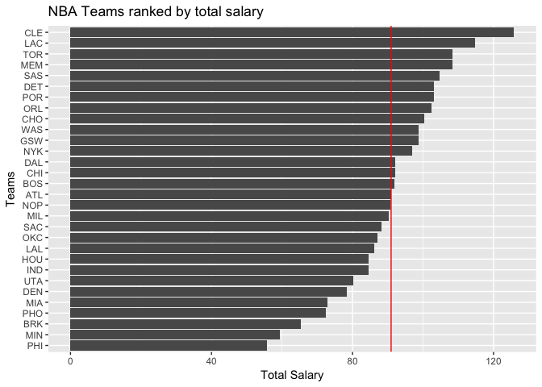
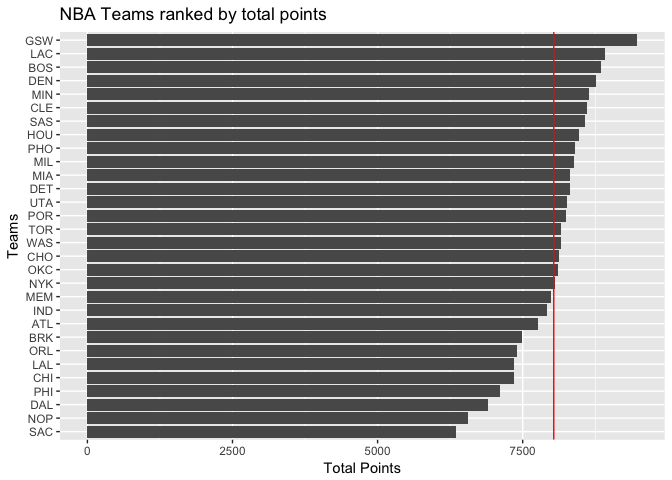
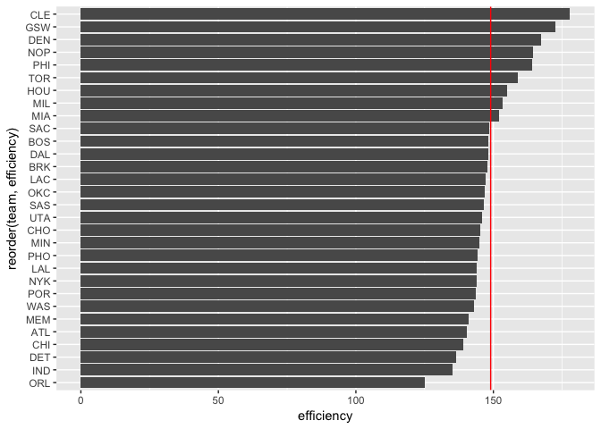
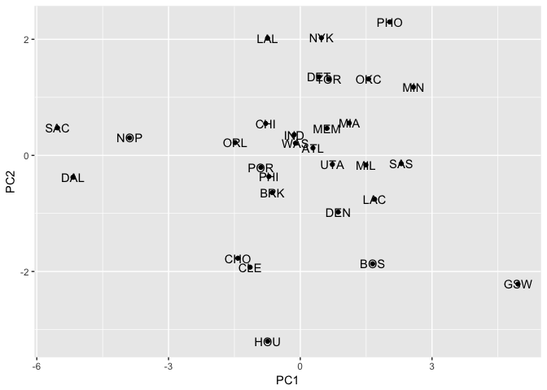
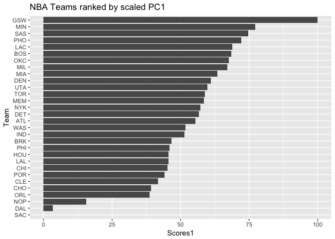

Ranking teams.Rd
================
Site Bai
10/8/2017

``` r
library(dplyr)
```

    ## 
    ## Attaching package: 'dplyr'

    ## The following objects are masked from 'package:stats':
    ## 
    ##     filter, lag

    ## The following objects are masked from 'package:base':
    ## 
    ##     intersect, setdiff, setequal, union

``` r
library(ggplot2)
setwd("/Users/baibai/stat133/stat133-hws-fall17/hw03/report")
roster <- read.csv("../data/nba2017-roster.csv",stringsAsFactors = FALSE)
stats <- read.csv("../data/nba2017-stats.csv")
team_salary <- summarise(
  group_by(roster,team),
  sum_salary=sum(salary)
)
team_salary$sum_salary <- round(team_salary$sum_salary/1000000,2)

salary_rank <- arrange(team_salary,desc(sum_salary))
salary_rank
```

    ## # A tibble: 30 x 2
    ##     team sum_salary
    ##    <chr>      <dbl>
    ##  1   CLE     125.79
    ##  2   LAC     114.78
    ##  3   TOR     108.46
    ##  4   MEM     108.34
    ##  5   SAS     104.69
    ##  6   DET     103.07
    ##  7   POR     103.03
    ##  8   ORL     102.41
    ##  9   CHO     100.25
    ## 10   WAS      98.78
    ## # ... with 20 more rows

``` r
ggplot(salary_rank,aes(x=reorder(team,sum_salary),y=sum_salary))+
  geom_bar(stat='identity')+coord_flip()+
  geom_hline(yintercept =mean(salary_rank$sum_salary),color="red")+
  labs(x="Teams",y="Total Salary")+
ggtitle("NBA Teams ranked by total salary")
```



the bar chart
=============

``` r
setwd("/Users/baibai/stat133/stat133-hws-fall17/hw03/report")
totalpoints <- stats$points3_made*3+stats$points2_made*2+stats$points1_made
stats <- mutate(stats,points=totalpoints)
stats <- mutate(stats,missed_fg=field_goals_atts-field_goals_made)
stats <- mutate(stats,missed_ft=points1_atts-points1_made)
stats <- mutate(stats,rebounds=off_rebounds+def_rebounds)
efficiency <- (stats$points+stats$rebounds+stats$assists+stats$steals+stats$blocks-stats$missed_fg-stats$missed_ft-stats$turnovers)/stats$games_played
stats <- mutate(stats,eff=efficiency)
freethrows <- stats$points1_made
stats <- mutate(stats,free_throws=freethrows)
largetable <- merge(roster,stats)

tp <- summarise(
  group_by(largetable,team),
          total_points=sum(points))

ggplot(tp,aes(x=reorder(team,total_points),y=total_points))+geom_bar(stat = 'identity')+coord_flip()+
  geom_hline(yintercept = mean(tp$total_points),color="red")+
  labs(x="Teams",y="Total Points")+
  ggtitle("NBA Teams ranked by total points")
```

 \# efficieny ranking.

``` r
efficiency <- (stats$points+stats$rebounds+stats$assists+stats$steals+stats$blocks-stats$missed_fg-stats$missed_ft-stats$turnovers)/stats$games_played
stats <- mutate(stats,eff=efficiency)
eff_ranking <- summarise(group_by(largetable,team),
          efficiency=sum(eff))

ggplot(eff_ranking,aes(x=reorder(team,efficiency),y=efficiency))+
  geom_bar(stat = "identity")+coord_flip()+
  geom_hline(yintercept = mean(eff_ranking$efficiency),color="red")
```



Principal components Analysis.
==============================

``` r
index <- summarise(
  group_by(largetable,team),
  points3=sum(points3_made),
  points2=sum(points2_made),
  free_throws=sum(free_throws),
  off_rebounds=sum(off_rebounds),
  def_rebounds=sum(def_rebounds),
  assists=sum(assists),
  steals=sum(steals),
  blocks=sum(blocks),
  turnovers=sum(turnovers),
  fouls=sum(fouls)
  )
pca <- prcomp(index[,2:11],scale. = TRUE)
names(pca)
```

    ## [1] "sdev"     "rotation" "center"   "scale"    "x"

``` r
eigs <- data.frame(
  eigenvalue=pca$sdev^2,
  proportion=round(pca$sdev^2/sum(pca$sdev^2),3)
)
eigs <- mutate(eigs,cumsumpro=cumsum(eigs$proportion))
eigs
```

    ##    eigenvalue proportion cumsumpro
    ## 1  4.69588631      0.470     0.470
    ## 2  1.70201009      0.170     0.640
    ## 3  0.97952464      0.098     0.738
    ## 4  0.77171938      0.077     0.815
    ## 5  0.53408824      0.053     0.868
    ## 6  0.47801622      0.048     0.916
    ## 7  0.38220374      0.038     0.954
    ## 8  0.26026243      0.026     0.980
    ## 9  0.13359274      0.013     0.993
    ## 10 0.06269622      0.006     0.999

``` r
pc<- prcomp(index[2:11],scale.=TRUE)$x
pc1_2 <- pc[,1:2]
pc1_2 <- as.data.frame(pc1_2)
pc1_2 <- mutate(pc1_2,team=index$team)
pc1_2
```

    ##           PC1        PC2 team
    ## 1   0.2883171  0.1281265  ATL
    ## 2   1.6475677 -1.8678932  BOS
    ## 3  -0.6378694 -0.6410895  BRK
    ## 4  -0.7889514  0.5491124  CHI
    ## 5  -1.4213891 -1.7716179  CHO
    ## 6  -1.1429197 -1.9254795  CLE
    ## 7  -5.1770470 -0.3771922  DAL
    ## 8   0.8628216 -0.9755539  DEN
    ## 9   0.4228059  1.3520635  DET
    ## 10  4.9580722 -2.2173199  GSW
    ## 11 -0.7434842 -3.2031420  HOU
    ## 12 -0.1393098  0.3561238  IND
    ## 13  1.6926408 -0.7550453  LAC
    ## 14 -0.7449230  2.0200116  LAL
    ## 15  0.6071090  0.4667924  MEM
    ## 16  1.1154708  0.5570744  MIA
    ## 17  1.4939629 -0.1637954  MIL
    ## 18  2.5754284  1.1769429  MIN
    ## 19 -3.8867632  0.3023898  NOP
    ## 20  0.4804728  2.0259452  NYK
    ## 21  1.5554071  1.3170619  OKC
    ## 22 -1.4831168  0.2204544  ORL
    ## 23 -0.7149664 -0.3641317  PHI
    ## 24  2.0387934  2.2997473  PHO
    ## 25 -0.8965058 -0.2071566  POR
    ## 26 -5.5291364  0.4742780  SAC
    ## 27  2.2990719 -0.1427248  SAS
    ## 28  0.6469827  1.3120040  TOR
    ## 29  0.7307586 -0.1550934  UTA
    ## 30 -0.1093009  0.2091070  WAS

``` r
ggplot(pc1_2,aes(x=PC1,y=PC2,label=team))+
  geom_point()+
  geom_text()
```



``` r
s1 <- ((pc1_2$PC1-min(pc1_2$PC1))/(max(pc1_2$PC1)-min(pc1_2$PC1)))*100
pc1_2 <- mutate(pc1_2,s1)

ggplot(pc1_2,aes(x=reorder(team,s1),y=s1))+
  geom_bar(stat = "identity")+coord_flip()+labs(x="Team",
                                                y="Scores1")+
  ggtitle("NBA Teams ranked by scaled PC1")
```

 \# `The graph of "NBA Teams ranked by sacled PC1 shows that the team 'GSW' is the most efficient`
