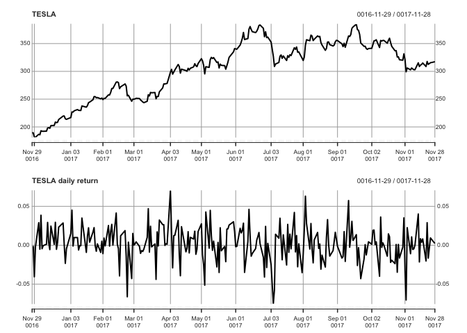

Observaing Tesla stock by using R
================
Site Bai
11/28/2017

### **Motivation:**

For my personal reason, I want to see the trend behind a specific stock and combine it with my economics
background to understand the WSJ news about the stock. More specifically, truely use the R to explain what
is taking place in the stock market and why works in such a way. And I am glad to show you how to do it in
this post. Thank you for reading this post in advance.


### **Introduction:**

Are you tired of people talking about stock and you cannot since you do not even know a bit of stock? I am! This
post is going to show you how to use powerful packages and functions of R to grasp the basic yet essential pattern
of any stock you want. Actually, it is all about time. Time is the most fatcor ensuring success in business,
especially in the stock market.Based on time seris, we could find the pattern from past and predcit the future.
Let's get started!

------------------------------------------------------------------------

##### All packages you need with its version as below:

| Packages          |   Name   |                     Version|
|-------------------|:--------:|---------------------------:|
| library(zoo)      |    zoo   |               version 1.8.0|
| library(xts)      |    xts   |              version 0.10.0|
| library(TTR)      |    TTR   |              version 0.23.2|
| library(forecast) | forecast |                 version 8.2|
| Rstudio           |  Rstudio |  version 3.3.2 (2016-10-31)|

------------------------------------------------------------------------

As the global warming more and more becomes a concern for every person living in this planet,eletric car seems to
be a promise for a healthy and clean environment. Among many exsiting electric cars,Tesla motors is no doubt the
league of the competitive electric car market. The eye-catching outline plus advanced engine, and the personal charisma of the founder,Elon Musk, will make Tesla more popular in the years ahead. How about Tesla's stock? Does
it will be as strong as its engines? Follow this post, you will find the answer.

------------------------------------------------------------------------

-   ###### I downloaded data from Yahoo! [Finance](https://finance.yahoo.com/quote/TSLA?p=TSLA). After cleaning data,I kept adjusted close price and the date index as follow. One more step before analysing the data, we need to convert data frame to the "xts" class, which could help us completing our analysis.

``` r
tesla <- read.csv("../../../stat133/stat133-hws-fall17/post2/TESLA.csv")
dim(tesla)
```

    ## [1] 252   2

``` r
rownames(tesla) <- tesla$Date
tesla$Date <- NULL
colnames(tesla) <- "Tesla"
```

-   ###### You could see the class of tesla\_stock is "xts zoo" since xts is part of the zoo.

``` r
tesla_stock <- xts(tesla,order.by = as.Date(rownames(tesla),"%m/%d/%Y"))
head(tesla_stock)
```

    ##             Tesla
    ## 0016-11-29 189.57
    ## 0016-11-30 189.40
    ## 0016-12-01 181.88
    ## 0016-12-02 181.47
    ## 0016-12-05 186.80
    ## 0016-12-06 185.85

``` r
class(tesla_stock)
```

    ## [1] "xts" "zoo"

-   ###### Surprisingly, if you use the basic plot function to plot the tesla\_stock, you will find a little different from what we have seen before. The time index is automatically displayed in the x\_axis. Isn't is amazing?

``` r
plot(tesla_stock,main = "TESLA")
```


-   ###### After viewing the fancy plot, what useful information we would get from it? Even though there are many flucations through time, the stock has a strong upward trend. That is all? Are you going to buy it based it? Of course not,we would like to focus on its return rate, which is more reliable for stock analysing.

-   ###### What we should do is converting our data to the price retuen rate? By applying the "ROC" function of the TTR package.

``` r
rtn <- ROC(tesla_stock)
plot(rtn)
```


-   ###### Do you want view two plots in one single window? let's do it!

``` r
par(mfrow=c(2,1))
plot(tesla_stock,main = "TESLA")
plot(rtn,main="TESLA daily return")
```



-   ###### What if you only care about the stock price started from 2017 instead of 2016? It is very simple.

``` r
rtn_2017 <- rtn["001701/001712"]
# For extracting a specific date, for instance, August 5 2017. 
rtn["00170825"]
```

    ##                 Tesla
    ## 0017-08-25 -0.0139236

------------------------------------------------------------------------

-   ###### From the daily return plot, do you still see the increasing trend? Probality not. Then how

    do we interpret the daily return plot? Will you buy this stock? We need to go one
    step further.

``` r
rtn <- rtn[-1]
hist(rtn,main = "Tesla stock return distribution",probability = TRUE)
lines(density(rtn),col="blue",lwd=2)
```


-   ###### At the same time, we could use box plot.In order to create the boxplot, we need to convert the data

    from xts class to numeric class. As you can see there are few outliers outside the whiskers and most
    of the returns are close to zero, but mostly the return is higher than average, indicating the tesla stock
    is a profitable stock.

``` r
rtn_box <- as.numeric(rtn)
boxplot(rtn_box,horizontal = TRUE,main=
          "Tesla return distribution")
```


-   ###### The autocorrelation also is a powerful tool to assess the stock. It tells you whether there is a relation between the price of past and of present, even predicting the future.

``` r
acf(rtn,main="Tesla return autocorrelation")
```


``` r
acf(rtn,plot = FALSE,lag.max = 1)
```

    ## 
    ## Autocorrelations of series 'rtn', by lag
    ## 
    ##     0     1 
    ## 1.000 0.027

-   ###### Know the today's value, what is the best bet for future? That is exactly what autocorrelationplot tells you. The result shows that yesterday's value has a positive relation with today's value, indicating a up trend of the Tesla stock.

------------------------------------------------------------------------

### Conclusion:

-   ###### By combining the plots above, the Tesla stock seems a less risky and profitable stock. It is very simple isn't it? Now you could use R to play with any stock you want.

-   ###### Wanna more fun? Adding the return of toyota which seems like a rival of Tesla motors, to the tesla stock.

``` r
toyota <- read.csv("../../../stat133/stat133-hws-fall17/post2/TOYOTA.csv")
rownames(toyota) <- toyota[,1]
toyota$Date <- NULL
toyota_stock <- xts(toyota,order.by = as.Date(rownames(toyota),"%m/%d/%Y"))
```

``` r
par(mfrow=c(2,1))
plot(tesla_stock,main = "TESLA")
plot(toyota_stock,main="TOYOTA")
```


-   ###### From the plot, I could see a interesting tread. When Tesla's stock is racing，Toyota's stock is decreaseing dramatically. Conversely, the time when Toyota;s stock is picking up, Tesla's stock started to decline. How about

    the return plot?

``` r
rtn2 <- ROC(toyota_stock)

rtn2 <- rtn2[-1]
plot(rtn,main = "TESLA")
```


``` r
lines(rtn2,col = "blue",lwd=2)
```


``` r
acf(rtn2,plot=FALSE,lag.max = 1)
```

    ## 
    ## Autocorrelations of series 'rtn2', by lag
    ## 
    ##      0      1 
    ##  1.000 -0.019

------------------------------------------------------------------------

##### Taking home messages:

1.  `You could go to Yahoo! finance to download any stock with any time frame you want.`
2.  `Using simple yet powerful and useful plot function to observe the stock`
3.  `How to use "xts","zoo" to convert data frame to the xts class.`
4.  `Using par function to view several plots in one window.`
5.  `Interpreting time series data by acf,box,and hitogram plots.`
6.  `Last but not least, pick up a profitable and less risky stock!`


------------------------------------------------------------------------

###### Reference:

-   `https://support.minitab.com/en-us/minitab/18/help-and-how-to/modeling-statistics/time-series/how-to/autocorrelation/interpret-the-results/autocorrelation-function-acf/`
-   `https://a-little-book-of-r-for-time-series.readthedocs.io/en/latest/src/timeseries.html#plotting-time-series`
-   `https://finance.yahoo.com/screener`
-   `http://www.stat.pitt.edu/stoffer/tsa4/R_toot.htm`
-   `https://www.statmethods.net/advstats/timeseries.html`
-   `https://www.scientificamerican.com/article/can-tesla-build-enough-electric-cars/`
-   `https://petolau.github.io/Forecast-double-seasonal-time-series-with-multiple-linear-regression-in-R/`
